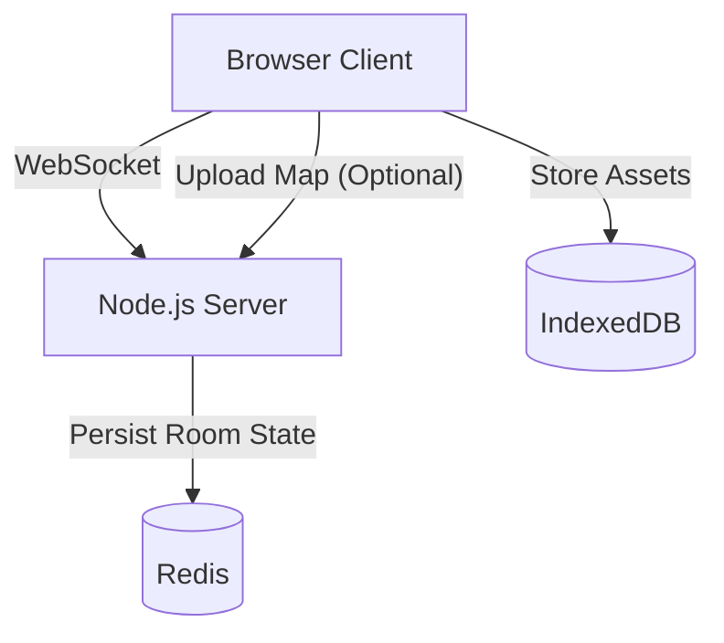

# TTRPG VTT MVP Product Specification

## 1. Overview
A lightweight, browser-based Virtual Tabletop (VTT) mimicking the simplicity of Owlbear Rodeo 1.0.
**Goal**: Zero-friction multiplayer map sharing. "It just works."

## 2. Architecture

### High-Level Diagram


### Key Components
- **Frontend**: Next.js, React, PixiJS (Canvas), Tailwind CSS.
- **Backend**: Node.js (Fastify/Express), Socket.IO.
- **State**:
    - **Server**: Authoritative `RoomState` in Redis (ephemeral, 24h TTL).
    - **Client**: Optimistic UI updates, syncs with Server `RoomState`.
    - **Assets**: Images stored in browser `IndexedDB`. Only map backgrounds are uploaded to server/S3 for sharing (optional for MVP, can be local blob if peer-to-peer but we are doing server-auth so upload is safer). *Correction*: User requirement says "Upload storage... local filesystem in dev".

### Data Model (Shared)

#### RoomState
```typescript
interface RoomState {
  id: string; // "cool-random-slug"
  passwordHash: string | null; // bcrypt
  gmId: string; // connection/guest ID of host
  config: {
    gridType: 'SQUARE';
    gridSize: number; // 50px default
    gridScale: number; // 5ft
  };
  map: {
    url: string;
    width: number;
    height: number;
    offset: { x: number, y: number };
    scale: number;
  } | null;
  tokens: Record<string, Token>;
  drawings: Record<string, Drawing>;
  fog: FogShape[];
  measurements: Measurement[]; // Transient
  timer: TimerState | null;
  players: Record<string, PlayerPresence>;
}
```

#### Token
```typescript
interface Token {
  id: string;
  type: 'CHARACTER' | 'PROP' | 'MOUNT' | 'ATTACHMENT';
  x: number;
  y: number;
  rotation: number;
  scale: number;
  layer: 'MAP' | 'FOG' | 'TOKEN' | 'ATTACHMENT';
  ownerId: string | null; // If set, only GM + user can move
  src: string; // URL or DataURI (if small)
  label: string;
  statusRings: string[]; // ['#ff0000', '#00ff00']
  locked: boolean;
  attachedToId?: string;
}
```

## 3. Features & UX

### A. Lobby & Auth
- **No Accounts**: User gets a random `guestId` stored in `localStorage`.
- **Create**: POST `/api/games` -> returns `{ slug, password }`.
- **Join**: Socket connect to `/slug`, auth handshake.

### B. Canvas & Tools
- **PixiJS**: Hardware accelerated 2D.
- **Structure**:
    - Layer 0: Background Map (Image).
    - Layer 1: Grid (Graphics).
    - Layer 2: Drawings (Graphics).
    - Layer 3: Tokens (Sprites/Container).
    - Layer 4: Fog (Graphics/Mask).
    - Layer 5: UI/Cursors (HTML overlay or Pixi).

### C. Tools Behavior
- **Pan**: Spacebar + Drag OR Pan Tool.
- **Select/Move**: Default V key. Click to select, Drag to move.
- **Fog**: Polygon drawing. "Cut" mode uses subtractive masking.
- **Sync**: All changes sent as Delta patches (e.g., `TOKEN_UPDATE { id, x, y }`).

## 4. API & Network Protocol

### HTTP
- `POST /api/upload`: Multipart upload for map backgrounds. Returns URL.
- `GET /healthz`: Health check.

### WebSocket Events (Socket.IO)
- `JOIN_ROOM { roomId, password, displayName }`
- `ROOM_STATE { state }` (Full sync on join)
- `PATCH_STATE { path, value }` (Delta updates)
- `EVENT_POINTER { x, y, color }` (Ephemeral)
- `EVENT_DICE { result, formula }` (Ephemeral)

## 5. Security
- Rate limit room creation.
- Max file size 15MB.
- Sanitize HTML in labels.
- 24h hard TTL on Redis keys.

## 6. Known Limitations (MVP)
- Single map per room.
- No integrated voice/video (use external).
- No complex dynamic lighting (just simple fog shapes).
